# SBEN424-Advanced-CV-Lab-04
# Region Growing (RG)
It is a pixel-based image segmentation method that involves exploring the neighbouring pixels of the initial seed points and deciding whether or not the pixel neighbours should be added to the region based on a threshold.

## Algorithm Analysis
* Loop over each pixel in the image.
* Initialise a seed number that is incremented by one each time a new region is indicated.
* Explore neighbouring pixels of current pixel and assign them the current seed number if the **error** function is less than the defined threshold.

    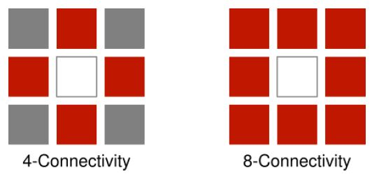

* Keep exploring the neighbours of neighbouring pixels, until the value of error function is greater than the threshold.
* If the value of error function is greater than the threshold, increment the seed number by one and repeat the steps above.

# 2D Grayscale Images
## Error Function
In 2D images, the error function equals the differemce between pixel value and the mean value of pixels in the current region.
``` matlab
err = abs(IMG(Xn,Yn) - MeanValue);
```
## Find the Best Threshold
## Coins Image
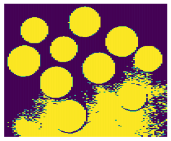

## Results
| Thresholds | 4 Neighborhood Connectivity |8 Neighborhood Connectivity |
| :---        |    :----:   |          ---: |
| 10      | 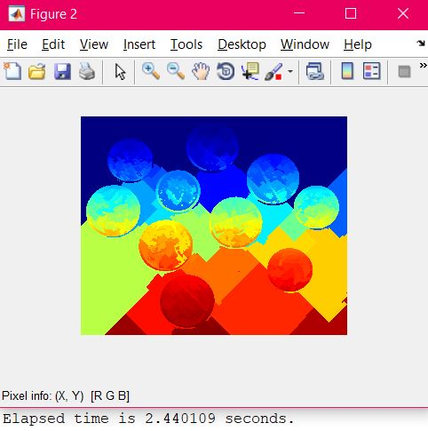 | 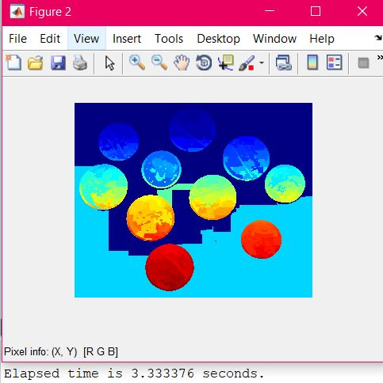 |
| 40   | 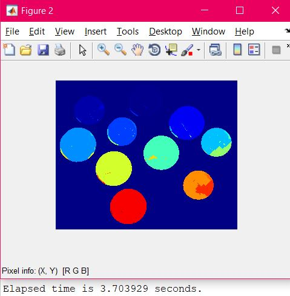| 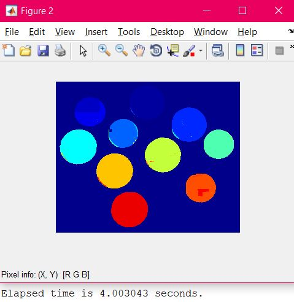 |
| 45   | | 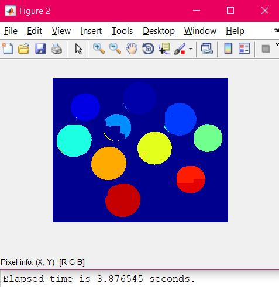 |
| 60   | | 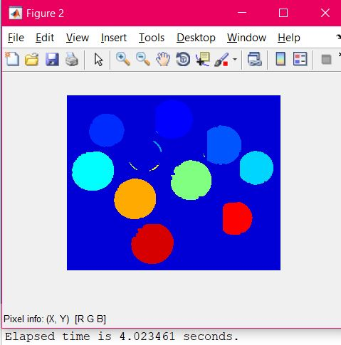 |


Based on the results in the table above, we can see that the best threshold using **4 Neighborhood Connectivity** is 45, as each coin is with a separate color, while the best threshold using **8 Neighborhood Connectivity** is 40.

---
## Medtest Image


## Results
| Thresholds | 4 Neighborhood Connectivity |8 Neighborhood Connectivity |
| :---        |    :----:   |          ---: |
| 10      |  |  |
| 20   | |  |
| 30   | |  |
| 40   | |  |


Based on the results in the table above, we can see that the best threshold using **4 Neighborhood Connectivity** is 30, as each coin is with a separate color, while the best threshold using **8 Neighborhood Connectivity** is 20.

---
## Time Analysis for Coins Image 
| Image | Time of 4 Neighborhood Connectivity | Time of 8 Neighborhood Connectivity | 
| :---        |    :----:   |     :---: |
| 10 | 2.440109 | 3.333376 |
| 40 | 3.703929 | 4.003043 | 
| 45 | 2.618060 | 3.876545 | 
| 60 | 3.745306 | 4.023461 | 
| **Average Time** | **3.126851** | **3.80910625** | 

## Time Analysis for Medtest Image 
| Image | Time of 4 Neighborhood Connectivity | Time of 8 Neighborhood Connectivity | 
| :---        |    :----:   |     :---: |
| 10 | 86.169583 | 80.341504 |
| 20 | 92.019552 | 84.405322 | 
| 30 | 90.282876 | 89.251123 | 
| 40 | 92.101989 | 88.592973 | 
| **Average Time** | **90.1435** | 	**85.6477305** |

# 3D RGB Images
## Error Function
In 3D images, the error function equals the differemce between pixel value and the mean value of pixels in the current region.
``` matlab
err =sqrt((Temp(1)-MeanValue(1))^2+(Temp(2)-MeanValue(2))^2+(Temp(3)-MeanValue(3))^2);
```
## Find the Best Threshold
## gantrycrane Image
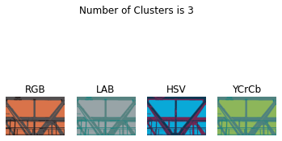

## Results
| Thresholds | 4 Neighborhood Connectivity |8 Neighborhood Connectivity |
| :---        |    :----:   |          :---: |
| 50   | |  |
| 100      |  |  |
| 150   | |  |
| 200   | |  |


Based on the results in the table above, we can see that the best threshold using **4 Neighborhood Connectivity** is 150, while the best threshold using **8 Neighborhood Connectivity** is 150.

---
## Woman Image

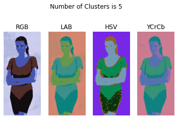

## Results
| Thresholds | 4 Neighborhood Connectivity |8 Neighborhood Connectivity |
| :---        |    :----:   |          ---: |
| 10      |  |  |
| 35   | |  |
| 50   | |  |
| 70   | |  |


Based on the results in the table above, we can see that the best threshold using **4 Neighborhood Connectivity** is 50, as each part form her body has diffirent color, while the best threshold using **8 Neighborhood Connectivity** is 35.

---
## Color Image
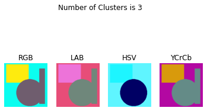

## Results
| Thresholds | 4 Neighborhood Connectivity |8 Neighborhood Connectivity |
| :---        |    :----:   |          ---: |
| 0   | |  |
| 2   | |  |
| 6   | |  |
| 10      |  |  |


Based on the results in the table above, we can see thatall thresholds the same but with the time table below we can see diffierents so using **4 Neighborhood Connectivity** the best threshold is 6 because time taken was 54.620950, while the best threshold using **8 Neighborhood Connectivity** is 2 as the time taken was 91.895968 .

---

## Time Analysis for Gantrycrane Image 
| Image | Time of 4 Neighborhood Connectivity | Time of 8 Neighborhood Connectivity | 
| :---        |    :----:   |     :---: |
| 50 | 79.589616 | 146.722498 | 
| 100 | 89.152181 | 154.242322 |
| 150 | 77.186286 | 205.255453 | 
| 200 | 95.894037 | 164.492582 | 
| **Average Time** | **85.45553** | **167.67821375** |

## Time Analysis for Woman Image 
| Image | Time of 4 Neighborhood Connectivity | Time of 8 Neighborhood Connectivity | 
| :---        |    :----:   |     :---: |
| 10 | 34.995706 | 61.280369 |
| 35 | 38.428445 | 62.878976 | 
| 50 | 40.815381 | 67.319985 | 
| 70 | 38.529533 | 71.111790 | 
| **Average Time** | **38.19226625** | **65.64778** |

## Time Analysis for Color Image 
| Image | Time of 4 Neighborhood Connectivity | Time of 8 Neighborhood Connectivity | 
| :---        |    :----:   |     :---: |
| 0 | 74.186221 | 107.089921 | 
| 2 | 58.789289 | 91.895968 | 
| 6 | 54.620950 | 124.493143 | 
| 10 | 59.216173 | 98.271619 |
| **Average Time** | **61.70315825** | **105.43766275** |

# Conclusion
Differences in time between 4 and 8 Neighbourhood Connectivity are not as noticeable in grayscale images as they are in RGB images.

In addition, different laptops produce different time results.
